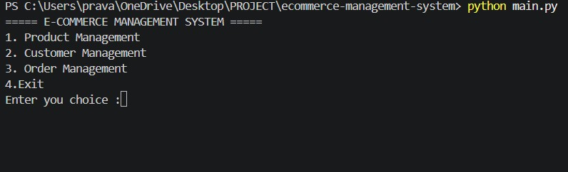
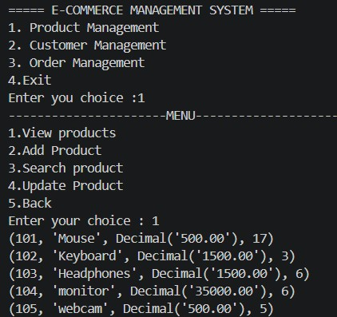
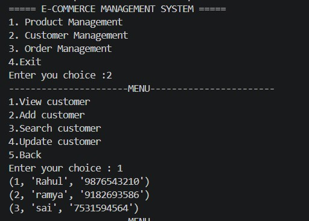
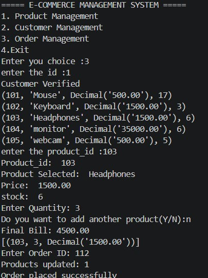

# E-Commerce Management System

A console-based **E-Commerce Management System** developed using **Python** and **SQL Server**. This application allows users to manage products, customers, and orders while automatically updating inventory after every purchase.

##  Features

### Product Management
- Add Product
- View All Products
- Search Product
- Update Product
- Delete Product

###  Customer Management
- Add Customer
- View All Customers
- Search Customer
- Update Customer
- Delete Customer

###  Order Management
- Verify Customer
- Display Available Products
- Purchase Multiple Products
- Generate Final Bill
- Update Product Stock Automatically
- Store Order Details in Database

##  Technologies Used

- Python 3
- SQL Server
- pyodbc
- Git
- GitHub
- Visual Studio Code

## Project Structure

ecommerce-management-system/
│
├── screenshots/
│   ├── main.jpg
│   ├── product-management.jpg
│   ├── customer-management.jpg
│   └── finalbill.jpg
│
├── main.py
├── product.py
├── customer.py
├── order.py
├── database.py
├── requirements.txt
└── README.md
### Main Menu

### Product Management

### Customer Management

### Final Bill

